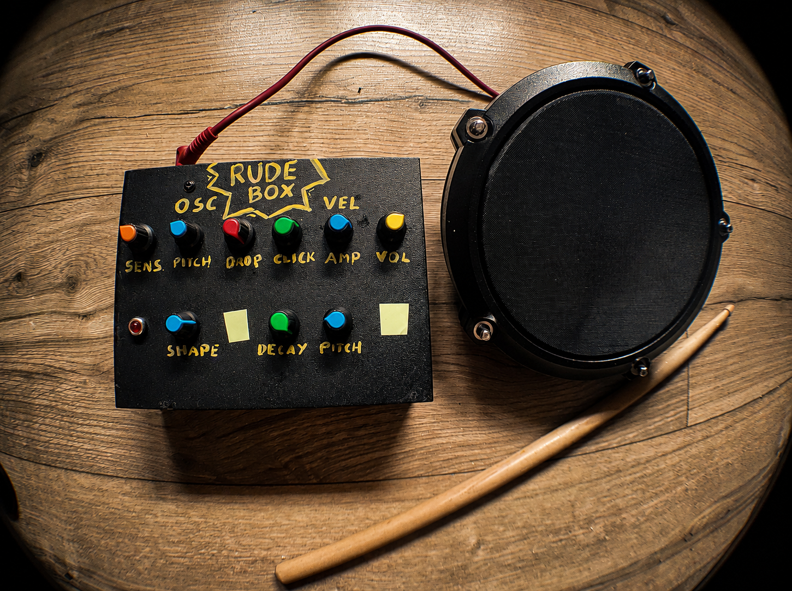
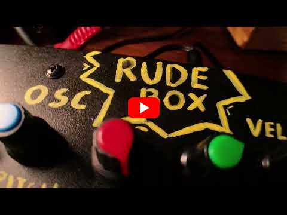

# RudeBox

*Single Voice Drum Synthesizer*

> [!TIP]
> **[Read the illustrated RudeBox build guide →](https://jakubthedeveloper.github.io/RudeBox/)**
>
> Build your own RudeBox step by step: components, wiring diagrams, firmware, debugging lessons, and a video demonstration.

## Instrument overview

RudeBox is an electronic drum synthesizer played with an external electronic drum pad. Each strike generates a single synthesized percussion voice that can be shaped with eight synthesis controls and an analog volume control. Its sound range covers toms, laser-like sweeps, noise, bass, kicks, and beeps.



Click the image below to watch the RudeBox demonstration on YouTube.

[](https://www.youtube.com/watch?v=bKgVX5p5UgE&list=RDbKgVX5p5UgE)

## Technical Details

RudeBox is built around an ESP32 Audio Kit V2.2 with an ESP32-A1S module and ES8388 audio codec. It reads the drum pad from the right LINE IN channel, converts each accepted strike into velocity, generates one monophonic drum voice, and sends the protected mono signal to the left audio output. A new accepted strike retriggers the current voice.

### Controls

Eight 10 kΩ linear-taper potentiometers shape the response and sound:

| Channel | Control | Effect |
| --- | --- | --- |
| A0 | SENSITIVITY | Adjusts how easily pad strikes reach higher velocity. |
| A1 | PITCH | Sets the oscillator's base pitch from 45 Hz to 1200 Hz. |
| A2 | PITCH DROP | Sets the initial pitch rise and downward sweep from 0 to 4.5 octaves. The sweep is slightly smaller for softer strikes. |
| A3 | CLICK | Adds a short noise transient to the beginning of the sound. |
| A4 | AMP VEL | Sets how strongly strike velocity affects oscillator volume, from nearly constant volume to full dynamics. |
| A5 | SHAPE | Morphs the oscillator from triangle through square to a narrow pulse wave. |
| A6 | DECAY | Sets the amplitude and pitch-envelope duration from 30 ms to 2.4 s. |
| A7 | PITCH VEL | Adds up to three octaves of pitch sweep according to strike velocity. |

In addition to these eight firmware-controlled parameters, the front panel has a VOLUME potentiometer in the analog audio path. It is not read by the ESP32 and is handled entirely outside the firmware.

SENSITIVITY determines the velocity assigned to each accepted pad strike. That same velocity controls the sensitivity LED and can affect oscillator level, click level, and pitch sweep. SHAPE remains live while a sound is playing; the other sound settings are captured when a strike triggers the voice.

### How the sound is generated

The pad input first passes through an impulse-shape check that rejects isolated electrical spikes and sharp voltage changes with weak tails. A valid strike is measured over a 128-sample window, adding about 2.9 ms of validation time at the 44.1 kHz sample rate. Its peak is then mapped to a normalized velocity using the SENSITIVITY setting.

Each accepted strike starts a main oscillator and an independent noise click. The main oscillator uses a continuously variable triangle, square, or pulse waveform. One exponential envelope controls both its volume decay and its fall from the initial pitch to the base PITCH. PITCH DROP supplies the basic sweep, while PITCH VEL adds a velocity-dependent sweep. The 8 ms noise click adds attack without changing the main DECAY time.

Before reaching the codec, the signal receives 6 dB of digital headroom and passes through a brickwall limiter with a ceiling of 0.9 full scale. The I2S stream runs continuously and sends exact-zero samples while the voice is idle.

### Pad input wiring

The drum pad is connected to the ESP32 LINE IN through the following input protection and filtering circuit:

```text
PAD TIP
   o
   |
 [100k]
   |
   +---------- SIGNAL ----------||----------> ESP32 LINE IN
   |                            100nF
   |
 [10k]
   |
  GND

SIGNAL ----||---- GND
           1nF

SIGNAL ----|>|----+
                  |
SIGNAL ----|<|----+---- GND
       Schottky clamps

PAD SLEEVE ---------------------------- GND
```

#### ESP32-A1S input limitation

The firmware selects the ES8388 `RINPUT2` line-input path, powers down the unused left analog input and ADC, and keeps microphone bias off. On the ES8388 version of the ESP32-A1S module, `MIC2N` and `LINEINR` share the codec's `RIN2` connection, while `MIC2P` and `LINEINL` share `LIN2`. Software cannot isolate the second onboard microphone from LINE IN because they are physically joined before the codec. Touching the unpowered microphone can therefore still cause a trigger; complete isolation requires disconnecting its coupling components or removing the microphone.

### Potentiometer wiring

The ADS7830 uses a separate I2C bus from the ES8388 codec:

- SDA: GPIO23
- SCL: GPIO18
- I2C address: `0x48`

The tested board is labeled `ADS7830 STEMMA QT`. Its reference wiring is:

- REF: connected to 3.3 V
- COM: left externally unconnected
- `Ext Ref` solder jumper: closed
- `Ext Com` solder jumper: closed

With the `Ext Com` jumper closed, the board's COM connection is used and the external COM pin remains unconnected. Each potentiometer has a 680 Ω series resistor and a 100 nF capacitor on its wiper:

```text
POT left leg  ---- GND
POT right leg ---- 3.3V

POT wiper ----[680R]----+------> ADS7830 CHx
                        |
                       === 100nF
                        |
                       GND
```

`CHx` is the ADS7830 channel listed in the controls table. The GND and 3.3 V rails are daisy-chained across all eight potentiometers. The controls are sampled every 5 ms and filtered to prevent small ADC fluctuations from changing the sound.

### Sensitivity LED

The sensitivity LED is connected from GPIO22 through a 680 Ω resistor to its anode, with its cathode connected to GND. It is driven by active-high 5 kHz, 8-bit PWM.

Only accepted pad strikes light the LED. Its brightness represents the same velocity used by the synth, with a response that keeps soft hits visible, and fades to off in about 150 ms. A new strike replaces the current level.

### Configuration and diagnostics

Hardware tuning and sound ranges are centralized in `include/app_config.h`:

- `AppConfig::AudioInput` selects the LINE IN channel and input gain.
- `AppConfig::HitDetection` contains trigger validation, re-arm, pad calibration, and sensitivity-response values.
- `AppConfig::Controls` contains potentiometer channels, scan behavior, ranges, and startup values.
- `AppConfig::Voice` contains oscillator, click, amplitude-velocity, and pitch-envelope limits.
- `AppConfig::AudioOutput` contains master gain and limiter settings.
- `AppConfig::Ui` contains the ADS7830 bus and sensitivity LED settings.

Serial diagnostics use 115200 baud. In the current configuration, `LOG_AUDIO_PEAKS` is enabled and streams the measured input peak as Teleplot-compatible `rawPeak` data. Trigger-validation, control-value, and fatal-error logging are disabled. These categories can be changed independently in `AppConfig::Diagnostics` and `AppConfig::Controls`.

For trigger tuning, compare `rawPeak` and the mapped velocity for light, medium, and strong strikes. `LOG_TRIGGER_VALIDATION` additionally reports whether a candidate was accepted, its captured maximum, active samples, tail maximum, tail activity, and window energy. An isolated spike should normally have one active sample and be rejected.

### Build and upload

The default PlatformIO environment builds the ESP32 firmware:

```sh
pio run
```

Build and upload it to the connected board with:

```sh
pio run -t upload
```

Use a 115200-baud serial monitor when any diagnostic category is enabled.

### Tests

The native tests exercise the hardware-independent audio path, including strike validation and lockout, velocity mapping, oscillator shape, click behavior, decay and retriggering, pitch modulation, amplitude dynamics, and output limiting.

Run them from the project root:

```sh
pio test -e native
```

The test scenarios regenerate SVG waveform and sensitivity plots in `test/artifacts/` for visual inspection.

### Code structure

The source is organized from application flow to hardware and signal-processing details:

- `main.cpp` starts and updates the application.
- `application.cpp` coordinates the audio path and user interface.
- `synth_engine.cpp` reads the pad input, detects strikes, triggers and renders the voice, and writes the output.
- `hit_detector.cpp` validates pad impulses, maps velocity, and prevents retriggering until the input is re-armed.
- `synth_voice.cpp` generates the oscillator, envelopes, pitch sweep, and noise click.
- `synth_control_input.cpp` scans and maps the eight potentiometers; `user_interface.cpp` owns the controls and sensitivity LED.
- `output_limiter.cpp` applies output gain and limiting; `waveforms.cpp` provides oscillator shapes.
- `audio_io.cpp`, `ads7830.cpp`, and `es8388.cpp` isolate hardware access.
